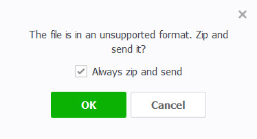

## Test Case Name : 
Block sending "exe" extension file  
## Precondition : 
1. Have LINE app on phone.
2. Have LINE account.
3. Log in LINE account already.
4. Have at least LINE account friend in list.
5. Have "exe" file on phone.
## Inputs : 
"exe" File extension
## Actions : 
1. Log in LINE account.
2. Send "exe" file extension to LINE account friend
## Expected Results :
1. LINE app block "exe" file that send to LINE account friend.
2. LINE app offer zip "exe" file and send to LINE friend.

## Postconditions : -
