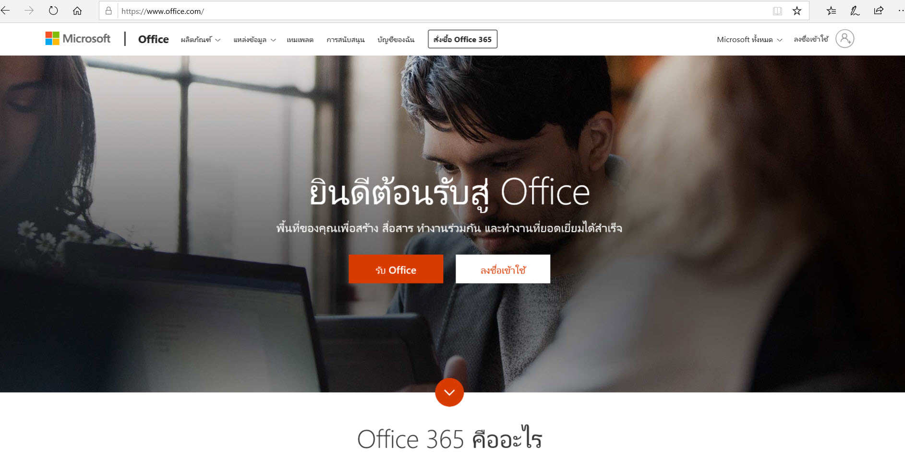

**Micorosoft Office 365**

**Microsoft Office 365** คือ ชุดโปรแกรมและบริกการคลาวด์สำหรับใช้งานภายในสำนักงาน ที่ Microsoft เป็นผู้พัฒนาขึ้น ประกอบด้วยบริการคลาวด์ที่สำคัญ ๆ เช่น Outlook, One Drive, Word, Excel เป็นต้น 

URL สำหรับเข้าใช้บริการคือ https://www.office.com

**Authentication**

Office 356 มีการ authentication หลักคือการใช้ username และ password ในการเข้าใช้งานระบบ ซึ่งหากต้องการตรวจสอบความปลอดภัยเพิ่มเติม administrator จะต้องทำการเปิดใช้งานระบบ จากนั้นผู้ใช้งานแต่ละคนสามารถ เลือกการตรวจสอบความปลอดภัยอีก 1 ทางเลือกจากจำนวน 5 แบบด้วยกัน คือ
* โทรติดต่อโทรศัพท์ของฉันที่ใช้ในการรับรองความถูกต้อ
* ส่งรหัสเข้าไปที่โทรศัพท์ของคุณที่ใช้เพื่อรับรองความถูกต้อง
* โทรมาที่โทรศัพท์สำนักงาน
* แจ้งให้ฉันทราบผ่านแอป
* ใช้รหัสการตรวจสอบจากแอปหรือโทเค็น
